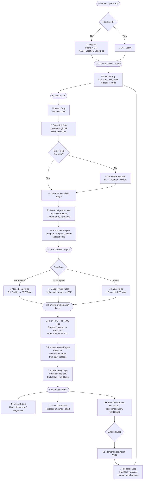
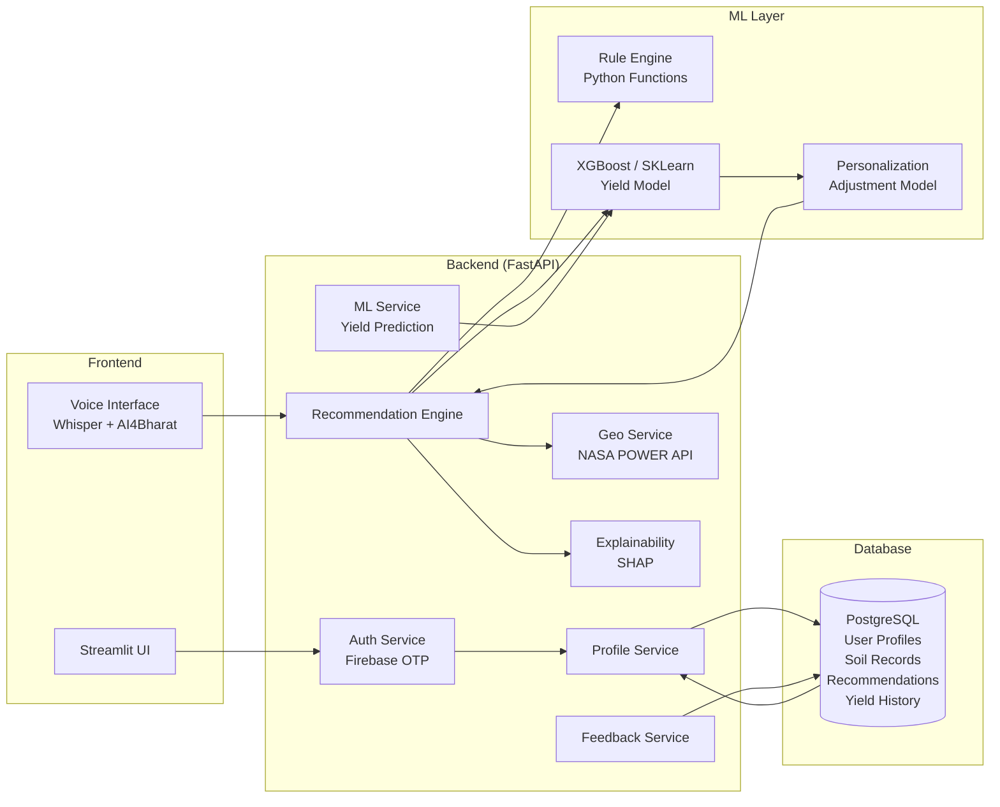

# 🌾 AgriSutra NE — Product Requirements Document (PRD)
**Version:** 1.0 | **Date:** April 2026 | **Status:** Draft

---

## 1. Executive Summary

**AgriSutra NE** (Agricultural Formula – North East) is a hyper-personalized, AI-powered fertilizer recommendation system built exclusively for the agro-climatic realities of Northeast India. It combines rule-based agronomic logic (derived from STCR principles and expert flowcharts), machine learning yield prediction, geo-intelligence, and multilingual voice interaction — all wrapped in a farmer-first experience.

> **One-line pitch:** _"AgriSutra NE tells every North-East farmer exactly what to put in their soil, why, and how much — in their own language."_

---

## 2. Problem Statement

| Problem | Impact |
|---|---|
| Generic fertilizer advice ignores NE India's unique soil profiles | Crop failures, soil degradation |
| Farmers lack access to soil testing or scientific guidance | Overuse / underuse of fertilizers |
| Language barrier (Hindi, Assamese, Nagamese) | Farmers can't use existing tools |
| No historical tracking of soil + yield | Farmers repeat mistakes season after season |
| No personalized or adaptive recommendations | One-size-fits-all advice fails smallholders |

**Target Geography:** Assam, Nagaland, Manipur, Meghalaya, Mizoram, Tripura, Arunachal Pradesh, Sikkim.

**Primary Crops Supported (v1):** Maize (Local & Hybrid), Kholar (region-specific legume).

---

## 3. Target Users

| User Type | Description |
|---|---|
| 🧑‍🌾 Primary Farmer | Smallholder (0.5–5 acres), limited literacy, local language speaker |
| 👨‍👩‍👧 Progressive Farmer | Medium landowner, data-aware, interested in yield optimization |
| 🏛️ Agricultural Officer | Uses aggregated data for policy, planning, district-level insights |
| 🔬 Researcher / Admin | Accesses anonymized dataset for model improvement & research |

---

## 4. Goals & Success Metrics

### 4.1 Product Goals
- Deliver accurate, personalized fertilizer recommendations for NE India crops
- Build a long-term soil and yield database per farmer
- Be accessible to low-literacy farmers via voice in local languages
- Be adaptive — learn from feedback each harvest season

### 4.2 Key Performance Indicators (KPIs)

| Metric | Target (Year 1) |
|---|---|
| Registered farmers | 5,000+ |
| Recommendation accuracy (vs actual outcome) | ≥ 80% |
| Yield improvement vs control group | ≥ 15% |
| Voice interaction usage rate | ≥ 50% of sessions |
| Farmer retention (season-over-season) | ≥ 60% |
| Data records collected | 50,000+ entries |

---

## 5. Project Flow Diagram



---

## 6. System Architecture



---

## 7. Detailed Feature Specifications

### 7.1 🔐 Farmer Identity Layer

**Purpose:** Create a persistent farmer identity that powers personalization and data accumulation.

**Feature Requirements:**

| ID | Requirement | Priority |
|---|---|---|
| F1.1 | Phone number + OTP login via Firebase Auth | Must Have |
| F1.2 | Farmer profile: Name, Village, District, State | Must Have |
| F1.3 | Auto-detect location using device GPS | Must Have |
| F1.4 | Manual location override (editable) | Must Have |
| F1.5 | Land size input (acres/hectares) | Must Have |
| F1.6 | Soil history: upload or enter past test results | Should Have |
| F1.7 | Crops grown history (editable list) | Must Have |
| F1.8 | Profile photo (optional) | Nice to Have |

**Data Fields Stored:**
```
farmer_id, phone, name, village, district, state, lat, lon,
land_size_ha, soil_history[], crop_history[], created_at, updated_at
```

---

### 7.2 📥 Input Layer

**Purpose:** Collect the minimum necessary input to generate an accurate recommendation.

| Input Field | Type | Required | Notes |
|---|---|---|---|
| Crop | Dropdown | ✅ Yes | Maize (Local/Hybrid), Kholar |
| Soil fertility (simple) | Radio: Low/Medium/High | ✅ One of two | If no test available |
| N value (kg/ha) | Number | ✅ One of two | From soil test |
| P₂O₅ value (kg/ha) | Number | ✅ One of two | From soil test |
| K₂O value (kg/ha) | Number | ✅ One of two | From soil test |
| pH | Number (4.0–9.0) | Optional | Improves accuracy |
| Target Yield (q/ha) | Number | ❌ Optional | ML predicts if absent |
| Season | Dropdown | ✅ Yes | Kharif / Rabi / Zaid |
| Year | Auto-filled | ✅ Yes | Current year |

**Voice Input:** All fields above must be enterable via speech in Hindi, Assamese, or Nagamese.

---

### 7.3 🧠 User Context Engine

**Purpose:** Before generating recommendations, check farmer's history to personalize the baseline.

**Logic:**
1. Fetch last 3 seasons of data for this farmer.
2. Compute average N/P/K applied vs recommended.
3. Detect overuse/underuse patterns.
4. Compute soil degradation trend (is fertility improving or declining?).
5. Pass context flags to Recommendation Engine.

**Context Flags Output:**
```python
{
  "nitrogen_overuse": True,      # used >20% more N than recommended
  "phosphorus_adequate": True,
  "potassium_underuse": False,
  "yield_trend": "improving",    # improving / stable / declining
  "seasons_of_data": 3
}
```

---

### 7.4 🌍 Geo-Intelligence Layer

**Purpose:** Make system location-aware without requiring user effort.

**Data Source:** NASA POWER API (`https://power.larc.nasa.gov`)

**Parameters Auto-fetched:**

| Parameter | Use |
|---|---|
| Monthly avg rainfall (mm) | Yield prediction, irrigation need |
| Avg temperature (°C) | Growing degree days, crop stress |
| Solar radiation | Biomass accumulation |
| Humidity | Disease risk |

**Agro-climatic Zone Classification:**
Map lat/lon → one of NE India's 7 agro-climatic zones to apply zone-specific FPE multipliers.

---

### 7.5 🤖 ML Yield Prediction Engine

**Purpose:** When farmer doesn't provide a target yield, predict optimal yield using ML.

**Model:** XGBoost Regressor

**Input Features:**
```
soil_N, soil_P, soil_K, soil_pH,
rainfall_mm, avg_temp_C, solar_rad,
crop_type, crop_variety, agro_zone,
past_yield_avg, seasons_of_data
```

**Output:** `predicted_yield_q_ha` (quintals per hectare)

**Training Data:**
- Kaggle Crop Production Dataset (India)
- Synthetic data generated from rule engine (1,000–5,000 rows)
- Collected farmer feedback data (grows over time)

**Model Versioning:** Retrained quarterly using new feedback data.

**Bonus Output:**
> _"Based on your past farm performance and this season's weather, 42 q/ha is achievable."_

---

### 7.6 ⚙️ Core Decision Engine (FPE Engine)

**Purpose:** The scientific heart — converts soil data + yield target → Fertilizer Prescription Equation (FPE) using the newly designed `FPEEngine` module.

**Pipeline Placement:**
`Input Layer (Farmer) → Yield Estimation (ML/Rule) → FPE Engine → Fertilizer Conversion`

The FPE Engine sits squarely between yield estimation and the actual fertilizer product computation, keeping its logic isolated from ML predictions.

**Based on:** STCR (Soil Test Crop Response) methodology with specific equations calibrated for NE region soils.

#### FPE Equations Supported:

**1. Maize**
- **Low Soil:**
  - FN = 3.93T - 0.26SN | FP₂O₅ = 1.28T - 0.87SP | FK₂O = 1.77T - 0.09SK
- **Medium Soil:**
  - FN = 4.11T - 0.36SN | FP₂O₅ = 1.97T - 1.66SP | FK₂O = 2.09T - 0.22SK
- **High Soil:**
  - FN = 4.87T - 0.41SN | FP₂O₅ = 3.86T - 2.81SP | FK₂O = 2.98T - 0.34SK

**2. Kholar**
- **Low Soil:**
  - FN = 23.76T - 0.52SN | FP₂O₅ = 11.45T - 1.89SP | FK₂O = 9.65T - 0.21SK
- **Medium Soil:**
  - FN = 25.26T - 0.57SN | FP₂O₅ = 12.37T - 1.88SP | FK₂O = 11.42T - 0.31SK
- **High Soil:**
  - FN = 26.45T - 0.63SN | FP₂O₅ = 14.11T - 1.97SP | FK₂O = 12.17T - 0.33SK

*(Note: If raw SN, SP, SK values are missing, the FPE Engine automatically maps the Soil Class to approximate default values).*

**Python Class Structure:**
```python
class FPEEngine:
    def compute(crop, soil_class=None, SN=None, SP=None, SK=None, target_yield=None):
        # Maps inputs to internal compute_maize() or compute_kholar()
        # Clamps negative values to 0
        # Returns {"N": ..., "P2O5": ..., "K2O": ...}

def nutrients_to_fertilizers(N, P2O5, K2O):
    urea_kg = N / 0.46          # Urea is 46% N
    ssp_kg  = P2O5 / 0.16      # SSP is 16% P2O5
    mop_kg  = K2O / 0.60       # MOP is 60% K2O
    return urea_kg, ssp_kg, mop_kg
```

---

### 7.7 🧪 Fertilizer Computation Layer

**Purpose:** Convert FPE → actual fertilizer product quantities.

**Output Table (shown to farmer):**

| Fertilizer | Amount (kg/ha) | Purpose |
|---|---|---|
| Urea | Computed | Nitrogen source |
| SSP (Single Super Phosphate) | Computed | Phosphorus source |
| MOP (Muriate of Potash) | Computed | Potassium source |
| FYM (Farm Yard Manure) | 5–10 tonnes/ha | Organic matter |

**Application Schedule:**
- Basal dose (at sowing): 50% N + 100% P + 100% K
- Top dress 1 (30 days): 25% N
- Top dress 2 (60 days): 25% N

---

### 7.8 🧠 Personalization Engine

**Purpose:** Adjust the base recommendation using farmer's historical overuse/underuse patterns.

**Adjustment Rules:**

| Condition | Adjustment |
|---|---|
| N overused >20% last season | Reduce N by 10% |
| Yield declining 2+ seasons | Increase FYM recommendation |
| pH < 5.5 detected | Add lime recommendation |
| Soil P increasing trend | Reduce P by 15% |

**Output message example:**
> _"Last season you used 25% more nitrogen than recommended. We've slightly reduced N this season to protect soil health."_

---

### 7.9 🔍 Explainability Layer

**Purpose:** Farmer understands WHY, not just WHAT.

**SHAP Integration:** Show top 3 features that drove the recommendation.

**UI Display:**
```
📊 Why this recommendation?

✅ Nitrogen is HIGH because:
   • Your soil N level is LOW (24 kg/ha)
   • Target yield is HIGH (45 q/ha)
   • Rainfall is adequate (supports uptake)

⚠️ Phosphorus is MODERATE because:
   • Soil P is MEDIUM from last test
   • P trend is stable over 2 seasons

✅ Potassium is LOW because:
   • Soil K is HIGH (past applications)
```

---

### 7.10 🗣️ Multilingual Voice AI

**Languages:** Hindi, Assamese, Nagamese

| Feature | Tool | Notes |
|---|---|---|
| Speech-to-Text | OpenAI Whisper | Supports Indic languages |
| Text-to-Speech | AI4Bharat TTS | Assamese, Hindi, Bengali |
| NLP Chatbot | HuggingFace Transformers | Agriculture QA fine-tuned |
| Multilingual NER | AI4Bharat NLP | Entity extraction from speech |

**Sample Voice Interaction:**
> 🎤 Farmer: _"Meri makai ki fasal hai, zameen medium hai"_
> 🔊 System: _"Theek hai. Aapki target yield kya hai? Agar nahi pata, main predict kar dunga."_

---

### 7.11 📊 Farmer Dashboard

**Sections:**

| Section | Contents |
|---|---|
| 📅 This Season | Current recommendation, application schedule |
| 📈 Yield Trends | Line chart: yield/ha over last N seasons |
| 🧪 Soil Health | Bar chart: N, P, K trends over time |
| 📋 History | Table: all past records |
| 🔔 Alerts | Soil degradation warnings, weather alerts |

---

### 7.12 🔄 Feedback Loop

**Trigger:** After estimated harvest date, app prompts farmer.

**Input:** Actual yield achieved (q/ha)

**Processing:**
1. Compare predicted vs actual yield.
2. Calculate error margin.
3. Store in training dataset.
4. If error > 15%, flag for model review.
5. Quarterly batch retraining of yield model.

**Gamification (optional):**
> 🏆 _"You matched the predicted yield within 5%! You're a top farmer this season."_

---

## 8. Data Requirements

### 8.1 Datasets

| Dataset | Source | Use |
|---|---|---|
| Soil Health Card Data | soilhealth.dac.gov.in | Soil classification, baseline fertility |
| Crop Production India | Kaggle (rajanand) | Yield model training |
| Weather Data | NASA POWER API | Rainfall, temperature features |
| Research Papers | Krishikosh | FPE tables, Kholar-specific rules |
| Agriculture QA | HuggingFace | Chatbot fine-tuning |
| AI4Bharat Corpus | ai4bharat.iitm.ac.in | Multilingual NLP |

### 8.2 Synthetic Data Generation

Generate 3,000–5,000 rows using rule engine:
```python
for _ in range(5000):
    soil = random.choice(["low", "medium", "high"])
    yield_target = random.randint(30, 70)
    N, P, K = get_fpe("maize", "hybrid", soil, yield_target, ...)
    dataset.append({"soil": soil, "yield_target": yield_target, "N": N, ...})
```

---

## 9. Technical Stack

| Layer | Technology | Rationale |
|---|---|---|
| Core Logic | Python 3.11 | Rule engine + ML |
| Backend API | FastAPI | Fast, async, production-ready |
| ML Models | Scikit-learn, XGBoost | Yield prediction |
| Explainability | SHAP | Feature importance |
| Speech-to-Text | OpenAI Whisper | Best Indic language support |
| Text-to-Speech | AI4Bharat TTS | Native Assamese/Hindi |
| NLP Chatbot | HuggingFace Transformers | Agriculture QA |
| Frontend | Streamlit (MVP) → React (v2) | Fast iteration |
| Database | PostgreSQL | Relational, structured |
| Auth | Firebase Auth | OTP login, easy setup |
| Weather API | NASA POWER | Free, reliable |
| Visualization | Plotly | Interactive charts |
| Data Pipeline | Pandas, NumPy | Clean + merge datasets |
| Deployment | Render (backend), Streamlit Cloud (frontend) | Free tier available |

---

## 10. API Design (FastAPI)

| Endpoint | Method | Description |
|---|---|---|
| `/auth/otp/send` | POST | Send OTP to phone |
| `/auth/otp/verify` | POST | Verify OTP, return JWT |
| `/farmer/profile` | GET/POST | Get or create farmer profile |
| `/recommend` | POST | Generate fertilizer recommendation |
| `/yield/predict` | POST | Predict yield using ML |
| `/geo/weather` | GET | Fetch weather for lat/lon |
| `/history` | GET | Farmer's historical records |
| `/feedback` | POST | Submit actual yield |
| `/dashboard` | GET | Aggregated farmer dashboard data |
| `/chat` | POST | Multilingual chatbot query |

---

## 11. Database Schema

```sql
-- Farmers table
CREATE TABLE farmers (
    farmer_id UUID PRIMARY KEY,
    phone VARCHAR(15) UNIQUE NOT NULL,
    name VARCHAR(100),
    village VARCHAR(100),
    district VARCHAR(100),
    state VARCHAR(50),
    lat FLOAT, lon FLOAT,
    land_size_ha FLOAT,
    created_at TIMESTAMP DEFAULT NOW()
);

-- Soil records
CREATE TABLE soil_records (
    record_id UUID PRIMARY KEY,
    farmer_id UUID REFERENCES farmers(farmer_id),
    season VARCHAR(20),
    year INT,
    crop VARCHAR(50),
    variety VARCHAR(50),
    soil_N FLOAT, soil_P FLOAT, soil_K FLOAT, soil_pH FLOAT,
    fertility_class VARCHAR(10),
    recorded_at TIMESTAMP DEFAULT NOW()
);

-- Recommendations
CREATE TABLE recommendations (
    rec_id UUID PRIMARY KEY,
    farmer_id UUID REFERENCES farmers(farmer_id),
    soil_record_id UUID REFERENCES soil_records(record_id),
    target_yield FLOAT,
    predicted_yield FLOAT,
    urea_kg FLOAT, ssp_kg FLOAT, mop_kg FLOAT, fym_tonnes FLOAT,
    explanation JSONB,
    created_at TIMESTAMP DEFAULT NOW()
);

-- Yield feedback
CREATE TABLE yield_feedback (
    feedback_id UUID PRIMARY KEY,
    rec_id UUID REFERENCES recommendations(rec_id),
    actual_yield FLOAT,
    submitted_at TIMESTAMP DEFAULT NOW()
);
```

---

## 12. Security & Privacy

| Concern | Mitigation |
|---|---|
| Data privacy | No personal data shared without consent |
| OTP auth | Firebase-managed, rate-limited |
| API security | JWT tokens, HTTPS only |
| Data storage | Encrypted at rest (PostgreSQL) |
| Anonymization | Research exports strip PII |

---

## 13. Development Roadmap

### Phase 1 — Core MVP (Weeks 1–2)
- [ ] Rule engine (flowchart → Python functions)
- [ ] Nutrient-to-fertilizer converter
- [ ] CLI test interface
- [ ] Streamlit basic UI
- [ ] Fertilizer output display

### Phase 2 — Data + ML (Weeks 3–4)
- [ ] Dataset collection and cleaning
- [ ] Synthetic data generation
- [ ] Yield prediction model (XGBoost)
- [ ] NASA POWER API integration
- [ ] SHAP explainability layer

### Phase 3 — User System (Weeks 4–5)
- [ ] Firebase OTP auth
- [ ] PostgreSQL schema setup
- [ ] Farmer profile CRUD
- [ ] Historical data storage
- [ ] User context engine

### Phase 4 — Intelligence (Weeks 5–6)
- [ ] Personalization engine
- [ ] Feedback loop + model retraining pipeline
- [ ] Farmer dashboard (charts + history)
- [ ] Alerts system

### Phase 5 — Voice + Language (Weeks 6–7)
- [ ] Whisper speech-to-text integration
- [ ] AI4Bharat TTS integration
- [ ] Hindi/Assamese/Nagamese support
- [ ] Chatbot (HuggingFace fine-tuning)

### Phase 6 — Polish + Deploy (Week 8)
- [ ] UI/UX refinement
- [ ] API documentation
- [ ] Deploy to Render + Streamlit Cloud
- [ ] Beta testing with farmers

---

## 14. Folder Structure

```
agrisutra-ne/
│
├── backend/
│   ├── main.py                  # FastAPI app entry point
│   ├── auth/
│   │   └── firebase_auth.py
│   ├── api/
│   │   ├── recommend.py
│   │   ├── yield_predict.py
│   │   ├── geo.py
│   │   ├── feedback.py
│   │   └── dashboard.py
│   ├── engine/
│   │   ├── rule_engine.py       # Core flowchart logic
│   │   ├── nutrient_calc.py     # FPE → fertilizer
│   │   ├── personalization.py   # Adjustment engine
│   │   └── explainability.py   # SHAP integration
│   ├── ml/
│   │   ├── yield_model.py       # XGBoost model
│   │   ├── train.py
│   │   └── models/              # Saved .pkl files
│   ├── db/
│   │   ├── models.py            # SQLAlchemy models
│   │   └── database.py          # DB connection
│   └── utils/
│       ├── geo_api.py           # NASA POWER client
│       └── synthetic_data.py   # Data generator
│
├── frontend/
│   ├── app.py                   # Streamlit main app
│   ├── pages/
│   │   ├── home.py
│   │   ├── recommend.py
│   │   ├── dashboard.py
│   │   └── history.py
│   └── components/
│       ├── charts.py
│       └── voice_input.py
│
├── ml_notebooks/
│   ├── 01_data_exploration.ipynb
│   ├── 02_synthetic_data_gen.ipynb
│   ├── 03_yield_model.ipynb
│   └── 04_shap_analysis.ipynb
│
├── data/
│   ├── raw/
│   ├── processed/
│   └── synthetic/
│
├── tests/
│   ├── test_rule_engine.py
│   └── test_yield_model.py
│
├── requirements.txt
├── .env.example
├── docker-compose.yml
└── README.md
```

---

## 15. Risk Register

| Risk | Likelihood | Impact | Mitigation |
|---|---|---|---|
| Low internet connectivity in NE | High | High | Offline mode for core recommendation |
| Farmer low digital literacy | Medium | High | Voice-first UI, minimal text |
| Whisper accuracy for Nagamese | Medium | Medium | Fine-tune on local speech samples |
| Soil test data unavailability | High | Medium | Simple Low/Med/High fallback |
| Cold start (no history) | High | Low | Use geo-zone defaults for new users |
| Model drift over seasons | Medium | Medium | Quarterly retraining pipeline |

---

## 16. Competitive Differentiation

| Feature | AgriSutra NE | Generic Apps |
|---|---|---|
| NE India crop focus (Kholar) | ✅ | ❌ |
| STCR-based rule engine | ✅ | ❌ |
| Personalization per farmer | ✅ | ❌ |
| Voice in Assamese/Nagamese | ✅ | ❌ |
| Explainable recommendations | ✅ | ❌ |
| Feedback loop learning | ✅ | ❌ |
| Historical soil trend tracking | ✅ | ❌ |

---

## 17. Glossary

| Term | Definition |
|---|---|
| FPE | Fertilizer Prescription Equation — formula to compute fertilizer need from soil test + yield target |
| STCR | Soil Test Crop Response — ICAR methodology for FPE |
| q/ha | Quintals per hectare — crop yield unit (1 quintal = 100 kg) |
| N, P, K | Nitrogen, Phosphorus, Potassium — primary nutrients |
| Urea | Fertilizer: 46% Nitrogen |
| SSP | Single Super Phosphate: 16% P₂O₅ |
| MOP | Muriate of Potash: 60% K₂O |
| FYM | Farm Yard Manure — organic soil amendment |
| Kholar | Region-specific legume crop grown in NE India |
| Agro-climatic zone | Geographic region classified by climate + soil type for agricultural planning |

---

*AgriSutra NE — Built for the soil, by the science, for the farmer.*
